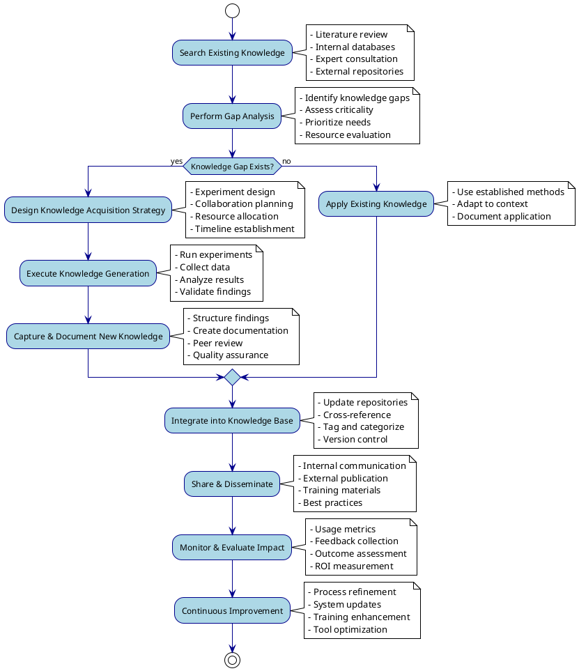

Knowledge Management is a key revenue source as it helps ensure you do not repeat what others may know and ensures you are spending the scarce resources you have in the most effective manner.

It does NOT happen automatically. Organizations need to take deliberate action to manage what they know and organize it in a manner that others in the areas of research can find and quickly learn and add their knowledge to this structured approach.

## The Knowledge Management Lifecycle

Effective knowledge management follows a continuous cycle that transforms information into actionable insights and organizational capability:

## Core Components of Effective Knowledge Management

### 1. Knowledge Discovery and Inventory
Before generating new knowledge, organizations must systematically discover what already exists:

- **Internal Knowledge Audit**: Catalog existing expertise, documents, data, and processes
- **External Landscape Analysis**: Map relevant knowledge in academic literature, industry reports, and competitor intelligence
- **Expert Networks**: Identify and connect with internal and external subject matter experts
- **Institutional Memory**: Capture tacit knowledge from experienced practitioners

### 2. Gap Analysis and Prioritization
Strategic knowledge management requires understanding not just what you know, but what you need to know:

- **Strategic Alignment**: Ensure knowledge priorities support organizational objectives
- **Risk Assessment**: Identify critical knowledge gaps that pose operational or competitive risks
- **Resource Optimization**: Balance knowledge acquisition costs against potential benefits
- **Timeline Considerations**: Prioritize urgent knowledge needs while building long-term capabilities

### 3. Knowledge Acquisition Strategies
Different types of knowledge gaps require different acquisition approaches:

- **Experimental Research**: Generate new knowledge through controlled studies and investigations
- **Collaborative Learning**: Partner with external organizations to share and develop knowledge
- **Technology Transfer**: Acquire knowledge through licensing, consulting, or talent acquisition
- **Systematic Learning**: Implement structured programs to build organizational capabilities

### 4. Knowledge Capture and Codification
Raw information becomes valuable knowledge only when properly structured and documented:

- **Documentation Standards**: Establish consistent formats for capturing different types of knowledge
- **Metadata Management**: Ensure knowledge assets are properly tagged and categorized for discovery
- **Version Control**: Track the evolution of knowledge and maintain historical context
- **Quality Assurance**: Implement review processes to ensure accuracy and reliability

### 5. Knowledge Sharing and Transfer
Knowledge creates value only when it reaches those who can apply it effectively:

- **Accessible Repositories**: Create searchable databases and knowledge bases
- **Communities of Practice**: Foster networks where practitioners can share insights and learn from each other
- **Training Programs**: Develop systematic approaches to transfer knowledge to new team members
- **Decision Support**: Integrate knowledge into workflows and decision-making processes

## The Digital Advantage in Knowledge Management

Modern digital tools have transformed knowledge management capabilities:

### Automated Knowledge Discovery
- **AI-Powered Search**: Use natural language processing to find relevant knowledge across diverse sources
- **Pattern Recognition**: Identify connections and trends that might not be obvious to human analysts
- **Real-Time Monitoring**: Track emerging knowledge in your field through automated literature reviews and alerts

### Enhanced Collaboration
- **Virtual Teams**: Enable knowledge sharing across geographic and organizational boundaries
- **Collaborative Platforms**: Facilitate collective knowledge creation and refinement
- **Expert Networks**: Connect knowledge seekers with relevant experts regardless of location

### Intelligent Organization
- **Semantic Tagging**: Use AI to automatically categorize and tag kn