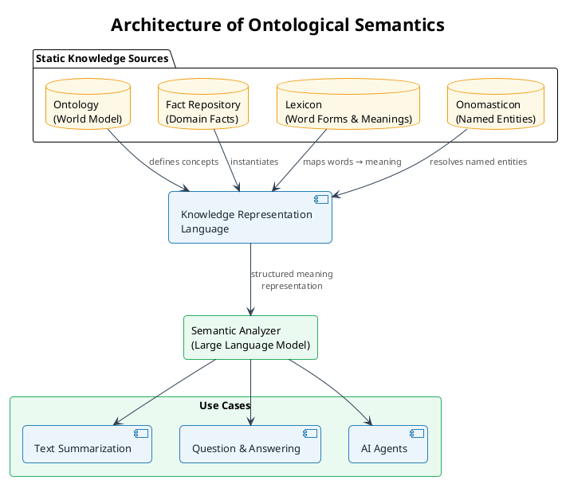
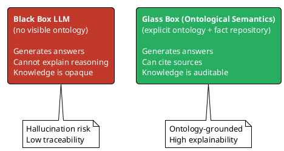

## Architecture of Ontological Semantics

The key components required to build a knowledge framework leveraging Ontological Semantics — the theoretical grounding that has enabled the current field of Large Language Models — which help us create knowledge out of existing sources in a systematic manner.

---

## The Four Static Knowledge Sources

### Ontology — the World Model
The ontology defines the concepts that exist in a domain and the relationships between them. It is the **schema** of the knowledge graph: what nodes (concepts) and edge types (relationships) are valid. Without an ontology, a knowledge base is just a bag of facts with no shared meaning.

### Fact Repository
Stores instantiated knowledge — specific, asserted facts about the world derived from texts, experiments, or expert input. Facts are the **populated rows** of the ontology's schema.

### Lexicon
Maps surface word forms to their semantic meanings. A lexicon allows the system to recognize that "kinase inhibitor," "enzyme blocker," and "phosphorylation suppressor" may all refer to the same ontological concept, enabling robust natural language understanding across varied terminology.

### Onomasticon
A specialized lexicon for named entities: people, organizations, places, products, and standards (e.g., "ICH Q10," "S88," "FDA"). The onomasticon lets the system resolve ambiguous proper nouns to canonical knowledge graph nodes.

---

## Knowledge Representation Language

The Knowledge Representation Language (KRL) is the formal grammar that ties the four sources together. It allows a system to derive *meaning* from raw text by:

1. Parsing surface language through the Lexicon
2. Resolving named entities through the Onomasticon
3. Grounding concepts against the Ontology
4. Asserting new facts into the Fact Repository

This pipeline is what transforms unstructured text into structured, queryable knowledge graph entries.

---

## Semantic Analyzer — Large Language Models

The Semantic Analyzer uses the KRL-structured knowledge to drive user-facing interactions. Modern LLMs play this role, but a key distinction applies:

The **Glass Box** advantage is critical in regulated domains like pharma, manufacturing, and clinical research — where every knowledge claim must be traceable to its source.

---

## Supported Use Cases

| Use Case | How Ontological Semantics Helps |
|----------|--------------------------------|
| **Text Summarization** | Extracts key ontology nodes and relationships from documents, producing summaries that preserve semantic fidelity |
| **Question & Answering** | Grounds answers in the Fact Repository and Ontology rather than statistical patterns alone |
| **AI Agents** | Agents navigate the knowledge graph to plan multi-step reasoning, with each hop traceable to an ontology edge |
| **Ontology Alignment** | Maps domain-specific standards (S88, S95, ICH) to a shared ontology for interoperability |

---

## Applied Example: This Site's Taxonomy as an Ontology

The STEAM knowledge graph on this site is itself an instance of ontological semantics in practice:

- **Ontology nodes**: Science, Technology, Engineering, Arts, Mathematics
- **Ontology edges**: `enables`, `implements`, `models`, `formalized by`, `grounded in`
- **Lexicon**: tags and categories on each page
- **Onomasticon**: persona names, standard names (ICH, S88, S95)
- **Fact Repository**: each page's `related_concepts` frontmatter

See the full graph: [STEAM Knowledge Graph →](/docs/knowledge-graph/)
