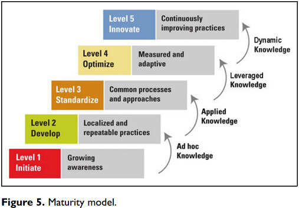

Knowledge management is probably one of the most difficult problems to tackle in this modern digital age for the shear volume, veracity, variety and velocity at which new content is generated makes it difficult to reassemble if deliberate actions for organization and tagging where not taken before hand.  Fortunately there's hope, for we're not in this alone, literally the entire world is struggling with this problems and scientists, technologists, engineers and mathematicians (STEM) have been deliberately attacking this problem through the creation of art (visualizations) - thereby transforming STEM to STEAM.

Driving a knowledge management framework in an organization enables exchange of information between people and systems seamlessly and deliberately which enables:

-   Lowers errors due to lack of data transcription (i.e., copy/paste)
-   More repeatable and predictable outcomes leading to increased flexibility and agility for the business
-   Ultimately drives innovation and continuous improvement practices within the ecosystem of systems and humans (i.e., get the systems working for humans not the other way around)

https://link.springer.com/content/pdf/10.1177/2168479016664773.pdf

<iframe src="https://link.springer.com/content/pdf/10.1177/2168479016664773.pdf" style="border:none; width:100%; height:500px;" allowfullscreen></iframe>