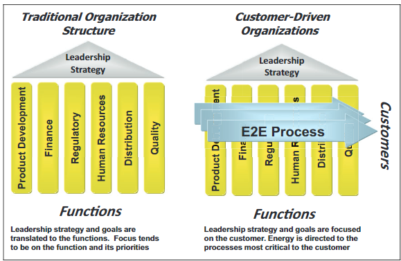

Process management is obviously important in any organization that is looking to achieve scalability and repeatability and thereby a strategy for building integrated processes at various levels of the organization is required.  A method by which one can achieve these processes is through interlocking SIPOCs whereby the output of one process is the input of another process.  In such a way, your creating a series of processes that can be linked into a graphical network thereby driving at transparency and clearly defined accountabilities.  Within the community of knowledge management, this is done via linked data or semantic web.

Components of the framework

-   Define and Characterize Processes (Processes at varying levels of the organization - See Interlocking SIPOCs)
-   Determine Process Documentation strategy (Process map then documentation - digital workflows)
-   Drive Flawless execution through a learning approach (drives at recording the actual process not just theoretical)
-   Monitor and improve process performance (Digital signatures of volume, veracity, velocity need to be taken into account)

https://link.springer.com/content/pdf/10.1177/2168479018817751.pdf

<iframe src="https://link.springer.com/content/pdf/10.1177/2168479018817751.pdf" style="border:none; width:100%; height:500px;" allowfullscreen></iframe>