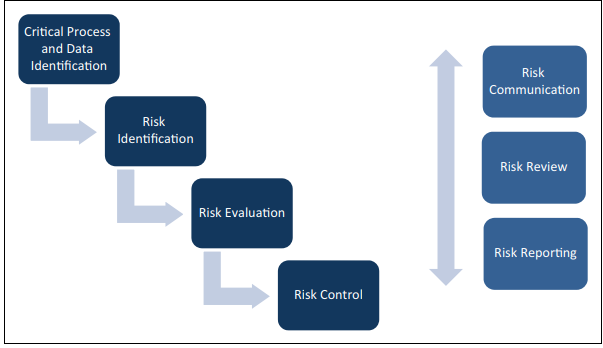

Risk management is a key term used across many organizations as an effective means to communicate broader sustained exposures to the organization and thereby drive a more end to end mindset focused upon the patients safety and efficacy.  The critical component on establishing an effective risk management framework is following the entire 4 step process as outlined below.

The minimal requirements for an effective risk management methodology based on ICH E6(2):

-   Critical Process and Data Identification (e.g., prior to identification of critical - you need to define the process itself - hence the homosapien bioreactor work)
-   Risk Identification (arises from the tracking between process steps and quality attributes/KPI's associated)
-   Risk Evaluation (further refinement of risk identification for prioritization)
-   Risk Control (defining the mechanisms you are going to take to control those risks)

https://link.springer.com/content/pdf/10.1177/2168479018817752.pdf

<iframe src="https://link.springer.com/content/pdf/10.1177/2168479018817752.pdf" style="border:none; width:100%; height:500px;" allowfullscreen></iframe>