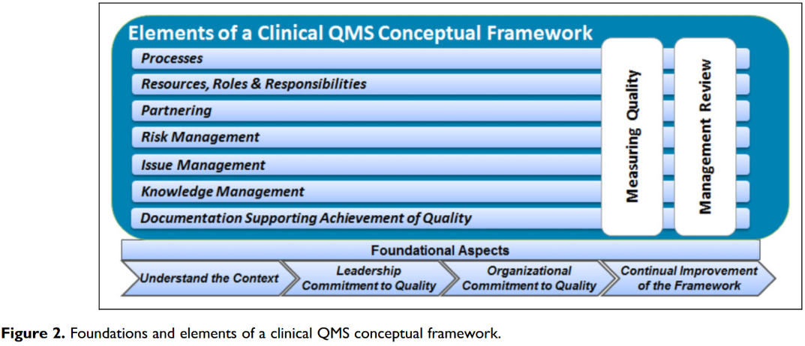

The foundational paper that set the groundwork for implementing a quality management system (QMS) through which organizations can systematically plan and achieve their quality objectives.  Paper addresses both the culture and system components that are required to achieve.

Components of the framework helps organization compartmentalize and deliver on the final vision and strategy.  Key components within which we are foundational include:

-   Understanding the context (Internal & External environments)
-   Leadership Commitment to Quality (e.g., proactive risk mitigation)
-   Organizational Commitment (e.g., ownership by everyone)
-   Continuous Improvement (e.g., never satisfied with status quo)

https://journals.sagepub.com/doi/pdf/10.1177/2168479015596018
