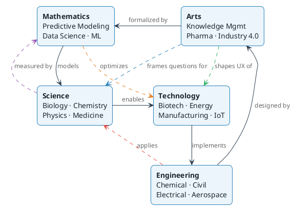

{}
We are taking a bold step forward and looking to teach many how to embrace this digital transformation to drive the successful outcome your looking to achieve
{}

Our Vision.

Our vision is to promote the integration of the arts (A) with the traditional STEM disciplines (Science, Technology, Engineering, Mathematics) to foster a more well-rounded, creative, and innovative approach to fundamental research and problem-solving.

 

Our Mission.

Our mission and current focus is to develop a knowledge graph associated with how STEM to STEAM framework should be setup and driven for teams interested in embracing conceptually.  

Explore the full graph: <a href="/docs/knowledge-graph/">STEAM Knowledge Graph &rarr;</a>

 

The Knowledge Graph.

The five STEAM domains are not isolated silos — they form an interconnected network where insights flow across boundaries. Each arrow below is a named relationship that explains <em>how</em> two domains connect.

