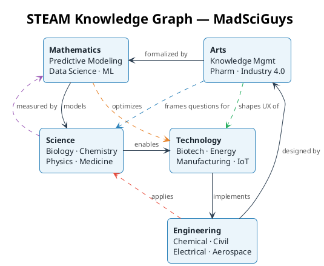
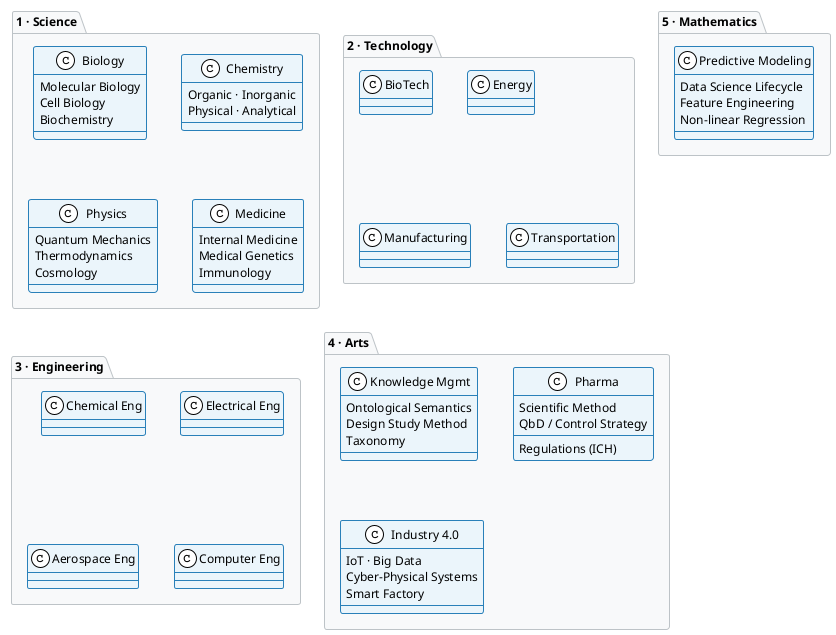
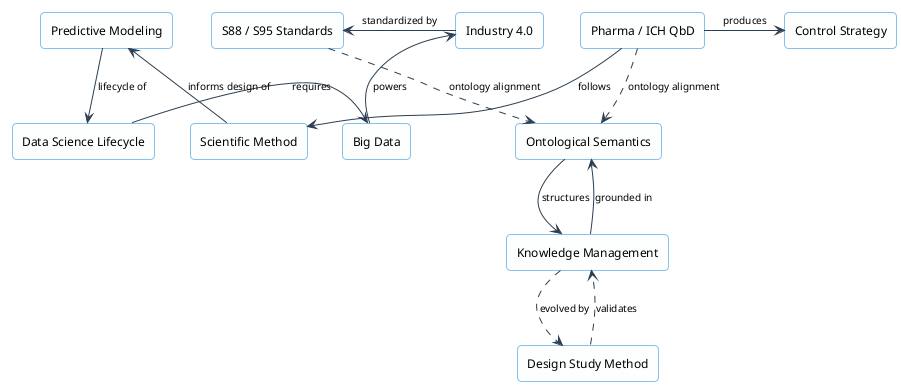

The knowledge graph below is the living map of this site. Every section is a **node**; every arrow is a named **edge** that explains *how* two areas of knowledge relate. This is the structural backbone behind the STEAM mission: not just five siloed disciplines, but an interconnected network where insights travel across boundaries.

## The STEAM Domain Graph



---

## Node Detail: What Each Domain Contains



---

## Cross-Domain Relationship Map

The edges below show the named semantic relationships used across this site. These are the *types* of connections that form the knowledge graph structure.



---

## Relationship Edge Vocabulary

The knowledge graph uses a controlled vocabulary of edge types so relationships carry semantic meaning:

| Edge Type | Meaning | Example |
|-----------|---------|---------|
| `enables` | A makes B possible | Science enables Technology |
| `implements` | B builds on A's principles | Technology implements Engineering |
| `models` | Math describes phenomena in A | Mathematics models Science |
| `formalized by` | A gains rigor through B | Arts formalized by Mathematics |
| `grounded in` | A's theory derives from B | Knowledge Mgmt grounded in Ontological Semantics |
| `powers` | A provides data/energy for B | Big Data powers Industry 4.0 |
| `standardized by` | B defines A's vocabulary | Industry 4.0 standardized by S88/S95 |
| `follows` | A uses B's process | Pharma follows Scientific Method |
| `informs design of` | A shapes how B is constructed | Scientific Method informs Predictive Modeling |
| `evolved by` | B refines and extends A | Knowledge Mgmt evolved by Design Study Methodology |

---

## Personas in the Graph

Each [persona](/persona/) sits at a specific set of nodes and traverses particular edge types in their daily work:

| Persona | Primary Nodes | Key Traversals |
|---------|--------------|----------------|
| [Knowledge Manager](/persona/knowledge-manager/) | Knowledge Mgmt, Ontological Semantics, Design Study Method | grounded-in, evolved-by, structures |
| [Data Scientist](/persona/data-scientist/) | Predictive Modeling, Data Science Lifecycle, Big Data | lifecycle-of, requires, informs-design-of |
| [Pharma Product Developer](/persona/pharma-product-developer/) | Pharma/ICH, Control Strategy, Scientific Method | follows, produces, standardized-by |
| [Systems Integration Engineer](/persona/systems-integration-engineer/) | Industry 4.0, S88/S95, IoT, Cyber-Physical Systems | standardized-by, powers, implements |
| [Analytical Chemist](/persona/analytical-chemist/) | Chemistry, Biology, Pharma | enables, applies, models |
| [Theoretical Chemist](/persona/theoretical-chemist/) | Chemistry, Physics, Mathematics | models, formalized-by, enables |
| [Mathematician](/persona/mathematician/) | Mathematics, Predictive Modeling, Data Science | models, formalized-by, optimizes |
| [Design Researcher](/persona/design-researcher/) | Arts, Design Study Method, Knowledge Mgmt | evolved-by, frames-questions-for, shapes |
| [Creative Strategist](/persona/creative-strategist/) | Arts, Industry 4.0, Engineering | designed-by, shapes-UX-of, enables |

---

## How to Extend This Graph

Every page on this site can participate in the knowledge graph by adding `related_concepts` to its frontmatter:

```yaml
related_concepts:
  - concept: "Page Title"
    url: "/docs/path/to/page/"
    relationship: "grounded-in"   # use vocabulary from table above
```

New content authors should ask: *What does this page depend on? What does it enable? What formalizes it?* Those answers are the edges that grow the graph.
